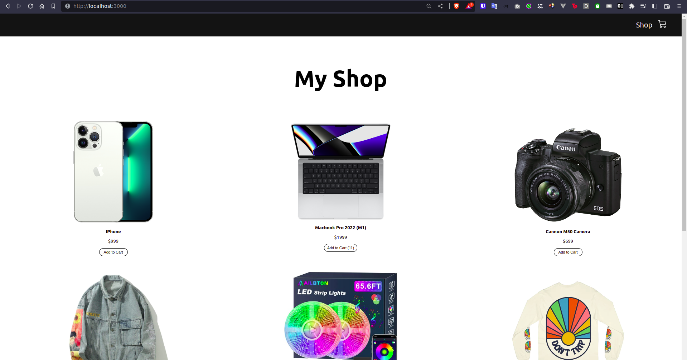
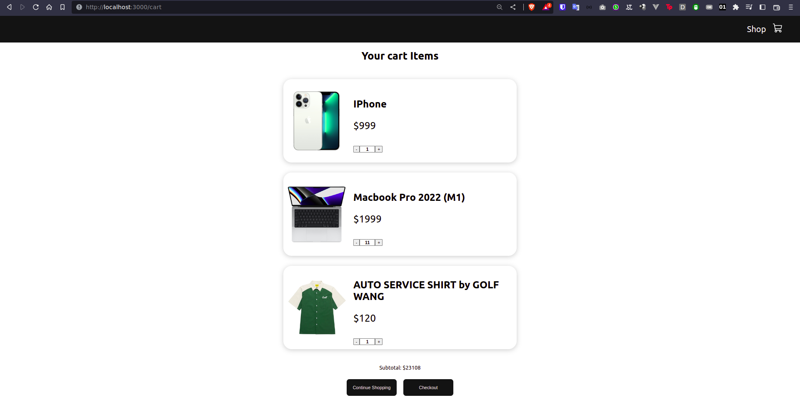

# react-shopping-cart
Creating a shopping cart app with React

Source: **https://www.youtube.com/watch?v=tEMrD9t85v4**

# Requirements
1. node/npm
# Setup
```sh
npm install
```
# Run
```sh
npm run start
```
> Open your browser at: http://localhost:3000

| Shop  | Cart |
| ------------- | ------------- |
|   |   |
 
# References
* https://www.youtube.com/watch?v=tEMrD9t85v4